# LiftKit Add Command Workflow

This document illustrates the complete workflow for the `liftkit add` command, showing how it interacts with registries and processes components.

## Workflow Diagram

```mermaid
flowchart TD
    A[User runs: liftkit add <component>] --> B{Check package.json exists}
    B -->|No| C[Error: No package.json found]
    B -->|Yes| D[Initialize RegistryProcessor]

    D --> E[Load components.json config]
    E --> F{Determine component source}

    F -->|URL| G[Fetch from direct URL]
    F -->|Local file| H[Read local JSON file]
    F -->|Component name| I[Fetch from registry: liftkit.pages.dev/r/<component>.json]

    G --> J[Parse JSON response]
    H --> J
    I --> J

    J --> K[Validate registry item schema]
    K -->|Invalid| L[Display validation errors & exit]
    K -->|Valid| M{Has registry dependencies?}

    M -->|Yes| N[Process dependencies recursively]
    M -->|No| O[Process main component]

    N --> P[Fetch each dependency]
    P --> Q[Validate each dependency]
    Q -->|Invalid| R[Log error & skip dependency]
    Q -->|Valid| S[Process dependency files]
    S --> T[Install dependency npm packages]
    T --> U[Continue to next dependency]
    U --> V{More dependencies?}
    V -->|Yes| P
    V -->|No| O

    O --> W[Collect all pending files without writing]
    W --> X[Resolve target paths using components.json aliases]
    X --> Y[Replace registry paths in content]
    Y --> Z{Check for existing files}
    Z -->|File exists| AA[Compare content]
    Z -->|File doesn't exist| BB[Mark for creation]
    AA -->|Identical content| CC[Mark as skipped]
    AA -->|Different content| DD[Add to conflicts list]
    CC --> EE{More files?}
    DD --> EE
    BB --> EE
    EE -->|Yes| Z
    EE -->|No| FF{Has conflicts?}
    FF -->|Yes| GG[Ask user for confirmation]
    FF -->|No| HH[Write all files]
    GG -->|User cancels| II[Exit gracefully]
    GG -->|User confirms| HH
    HH --> JJ[Create directories if needed]
    JJ --> KK[Write processed files to disk]

    KK --> LL[Collect npm dependencies]
    LL --> MM[Install dependencies via npm]
    MM --> NN{Has CSS variables?}

    NN -->|Yes| OO[Process CSS variables]
    NN -->|No| PP[Display success message]

    OO --> QQ[Generate CSS content]
    QQ --> RR[Append to globals.css]
    RR --> PP

    PP --> SS[Show processed files count]
    SS --> TT[Show installed dependencies]
    TT --> UU[Command completed]

    %% Error handling
    C --> VV[Exit with error code 1]
    L --> VV
    R --> U
    II --> VV

    %% Styling
    classDef success fill:#d4edda,stroke:#155724,color:#155724
    classDef error fill:#f8d7da,stroke:#721c24,color:#721c24
    classDef process fill:#d1ecf1,stroke:#0c5460,color:#0c5460
    classDef decision fill:#fff3cd,stroke:#856404,color:#856404
    classDef registry fill:#e2e3e5,stroke:#383d41,color:#383d41
    classDef conflict fill:#fef3cd,stroke:#856404,color:#856404

    class PP,UU success
    class C,L,VV error
    class D,E,G,H,I,J,O,W,X,Y,Z,AA,BB,CC,DD,EE,FF,GG,HH,JJ,KK,LL,MM,OO,QQ,RR,SS,TT process
    class B,F,K,M,V,Z,EE,FF,NN decision
    class I,P registry
    class GG conflict
```



## Init Command Behavior

### Default Prompts

The `init` command now defaults to "yes" for all prompts, making it more user-friendly:

- **tsconfig.json creation**: Defaults to "yes" when no tsconfig.json exists
- **tsconfig.json updates**: Defaults to "yes" when merging configurations
- **package.json script addition**: Defaults to "yes" when adding the "add" script

### Non-Interactive Mode

Use the `--yes` flag to skip all confirmations:

```bash
liftkit init --yes
```

This is useful for:

- CI/CD pipelines
- Automated scripts
- Non-interactive environments

## Registry Interaction Details

### 1. Component Source Resolution

The add command supports three ways to specify a component:

- **Direct URL**: `liftkit add https://example.com/component.json`
- **Local file**: `liftkit add ./local-component.json`
- **Registry name**: `liftkit add button` (fetches from `https://liftkit.pages.dev/r/button.json`)

### 2. Registry Item Structure

Each registry item contains:

```typescript
interface RegistryItem {
  name: string;
  type: RegistryType;
  description?: string;
  dependencies?: string[];
  devDependencies?: string[];
  registryDependencies?: string[]; // Other registry items this depends on
  files?: RegistryFile[];
  cssVars?: CSSVars;
}
```

### 3. Dependency Resolution

The system handles two types of dependencies:

- **NPM Dependencies**: Regular npm packages installed via `npm install`
- **Registry Dependencies**: Other registry items that must be processed first

### 4. File Processing Pipeline

For each file in the registry item:

1. **Path Resolution**: Maps registry paths to local paths using `components.json` aliases
2. **Content Processing**: Replaces registry import paths with local aliases
3. **Conflict Checking**: Checks if file already exists and compares content
4. **User Confirmation**: If conflicts exist, asks user for confirmation before overwriting
5. **Directory Creation**: Creates necessary directory structure
6. **File Writing**: Writes processed content to disk

### 4.1 File Conflict Resolution

The system now includes intelligent file conflict handling:

- **Identical Files**: If an existing file has identical content, it's skipped with a message
- **Different Files**: If an existing file has different content, the user is prompted for confirmation
- **New Files**: Files that don't exist are created normally
- **Force Mode**: Use `--force` or `--skip-conflicts` to bypass conflict checking

Example interaction:

```
⚠️  The following files already exist and will be overwritten:
  - src/components/button.tsx
  - src/lib/utils.ts

Do you want to proceed with overwriting these files? (y/N): y
✏️  Updated src/components/button.tsx
⏭️  Skipped src/lib/utils.ts (identical content)
📄 Created src/components/icon.tsx
```

### 5. Path Replacement Examples

Registry paths are transformed to local paths:

- `registry/nextjs/components/button.tsx` → `@/components/button.tsx`
- `registry/universal/lib/utils.ts` → `@/lib/utils.ts`
- `registry/nextjs/lib/hooks.ts` → `@/lib/hooks.ts`

### 6. CSS Variables Processing

If the registry item includes CSS variables, they are appended to `src/app/globals.css`:

```css
/* CSS Variables from Registry */
--primary: #007acc;
--secondary: #6c757d;
```

## Key Components

### RegistryProcessor

- Handles file processing and dependency installation
- Manages path resolution and content transformation
- Tracks processed URLs to avoid duplicates

### Registry Schema Validation

- Validates registry items against JSON schema
- Ensures required fields are present
- Provides detailed error messages for invalid items

### Dependency Tree Building

- Resolves circular dependencies
- Calculates optimal installation order
- Processes dependencies recursively

This workflow ensures that components are properly installed with all their dependencies, files are correctly placed, and the project structure remains consistent.
